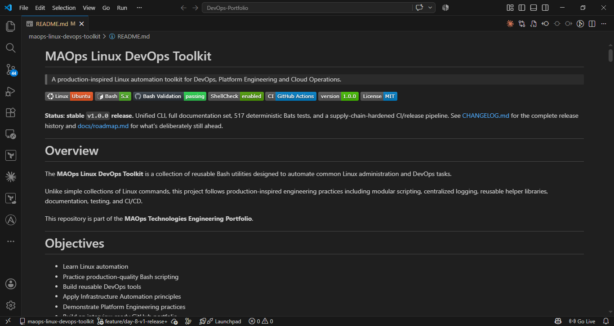
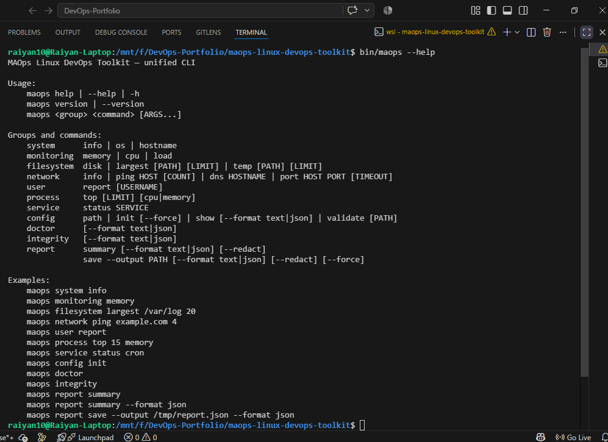
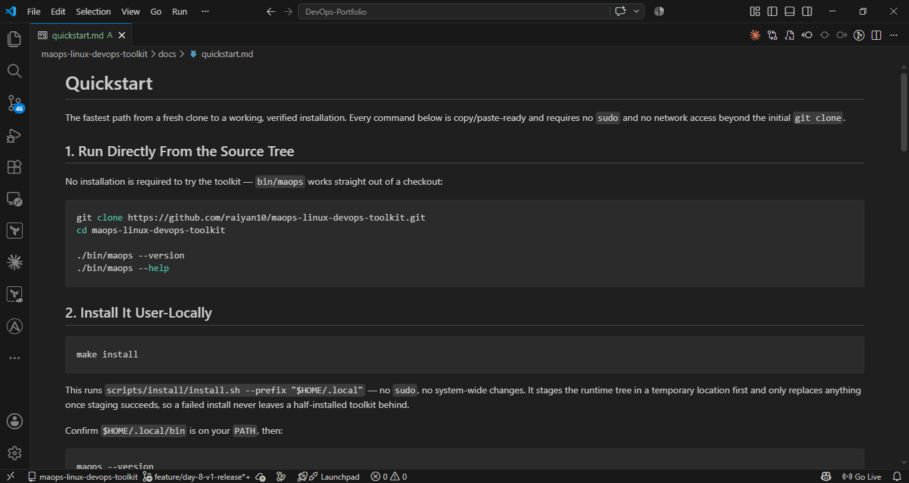
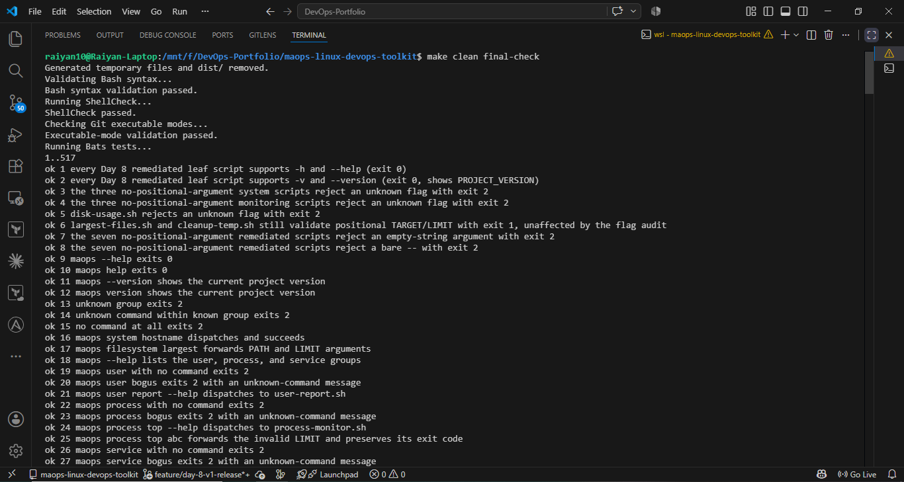
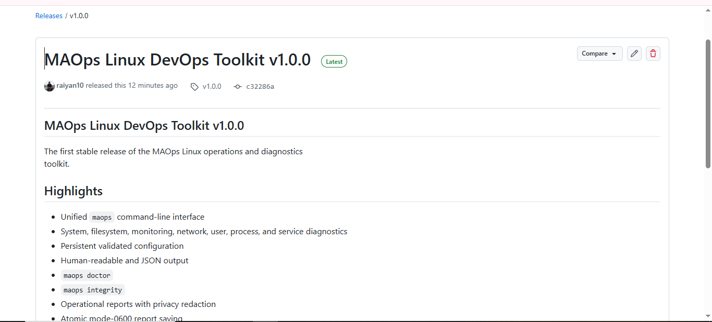

# Screenshots

## Project 1: MAOps Linux DevOps Toolkit

A curated set of screenshots from the toolkit's `v1.0.0` release day. The
complete per-day screenshot history lives in the toolkit repository under
[`docs/images/`](https://github.com/raiyan10/maops-linux-devops-toolkit/tree/main/docs/images).

| README Landing Page | `maops --help` (v1.0.0) |
|---|---|
|  |  |

| Quickstart Demo | 529/529 Tests Passing (`final-check`) |
|---|---|
|  |  |

| v1.0.0 GitHub Release |
|---|
|  |
