# Screenshots

## Project 1: MAOps Linux DevOps Toolkit

A curated set of screenshots from the toolkit's `v1.0.0` release day. The
complete per-day screenshot history lives in the toolkit repository under
[`docs/images/`](https://github.com/raiyan10/maops-linux-devops-toolkit/tree/main/docs/images).

| README Landing Page | `maops --help` (v1.0.0) |
|---|---|
| 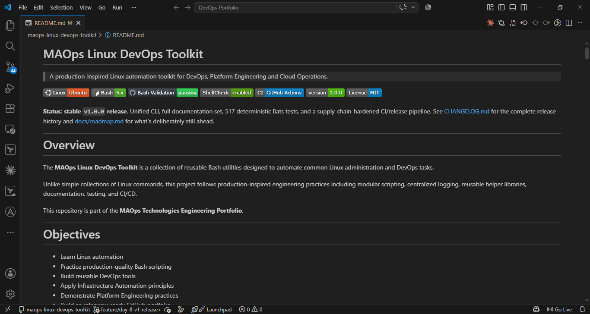 | 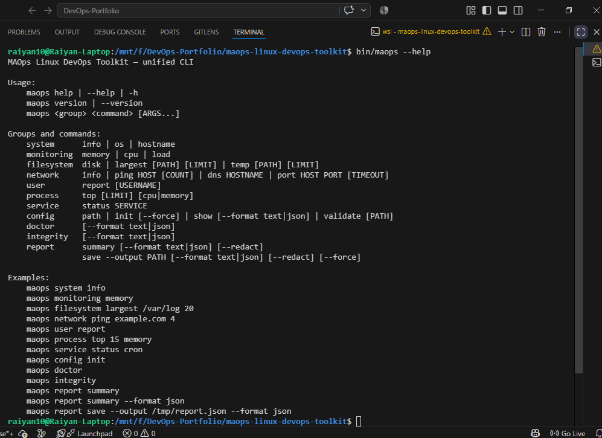 |

| Quickstart Demo | 529/529 Tests Passing (`final-check`) |
|---|---|
| 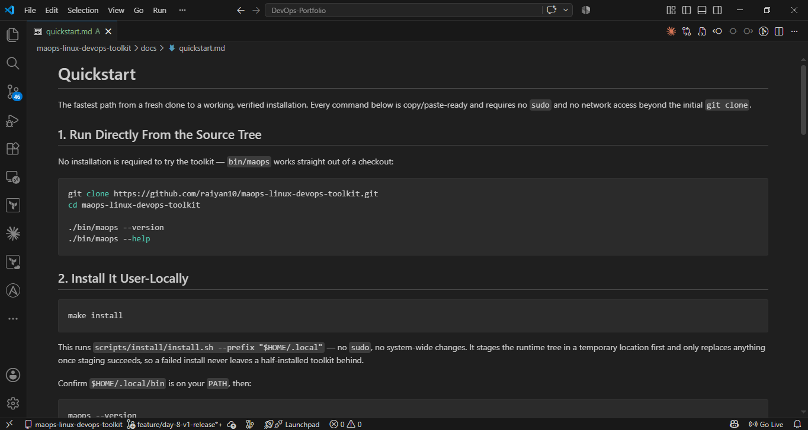 | 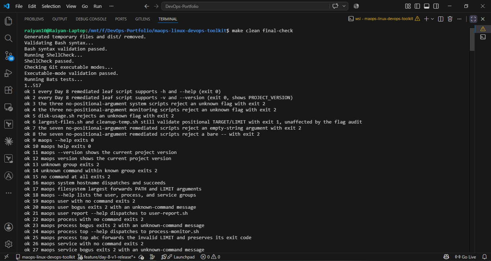 |

| v1.0.0 GitHub Release |
|---|
| 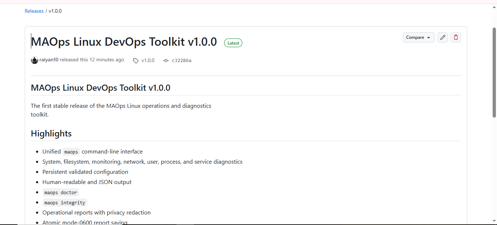 |

## Project 2: MAOps Python DevOps Automation Toolkit

A curated set of screenshots from the toolkit's `v0.7.0` release day. The
complete per-day screenshot history lives in the toolkit repository under
[`docs/images/`](https://github.com/raiyan10/maops-python-devops/tree/main/docs/images).

| `maops-py --help` (v0.7.0) — full CLI surface from one entry point | `report aggregate` — multi-report normalization into one structural summary |
|---|---|
| 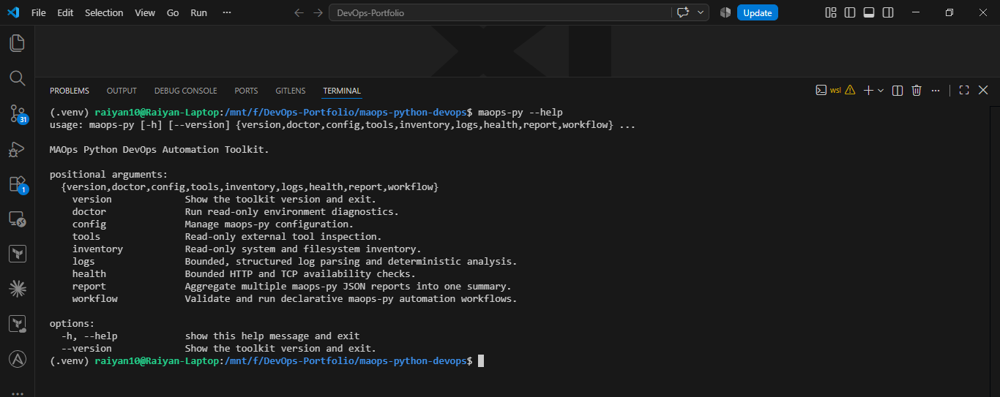 | 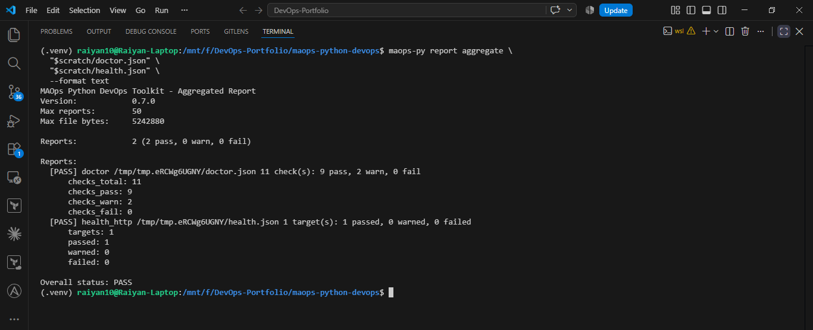 |

| `workflow run` — declarative TOML automation over existing internal APIs | 1323/1323 tests passing, 98.49% coverage (`make release-check`) |
|---|---|
| 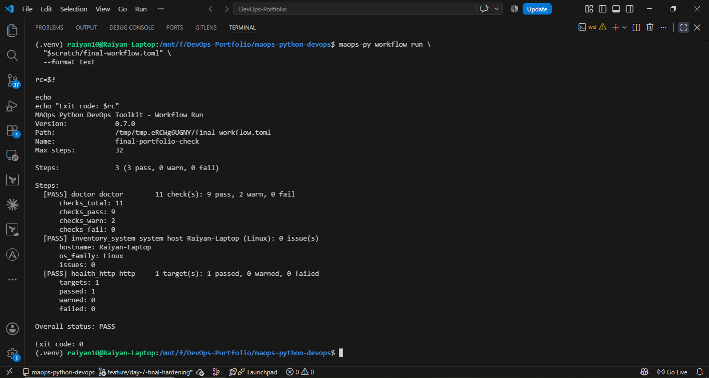 | 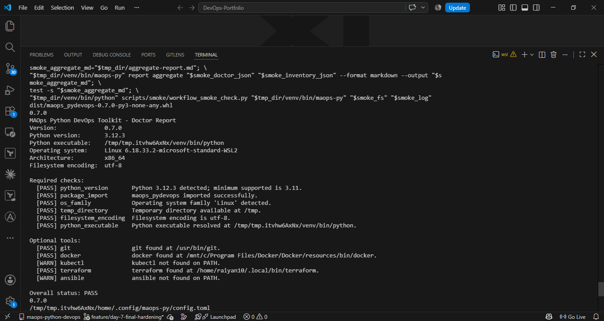 |

| `v0.7.0` GitHub Release — final planned release of the seven-day portfolio arc |
|---|
| 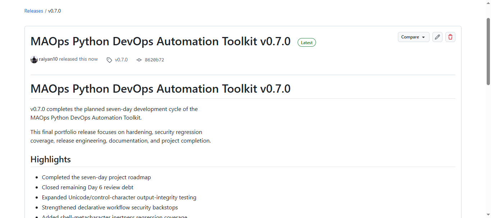 |

## Project 3: MAOps Docker Platform

A curated set of screenshots from the platform's `v1.0.0` release day. The
complete per-day screenshot history lives in the platform repository under
[`docs/images/`](https://github.com/raiyan10/maops-docker-platform/tree/main/docs/images).

| CI — `Quality` and `Release policy` jobs passing on `main` | `v1.0.0` tag release run — `Validate` and `Publish GitHub Release` |
|---|---|
| 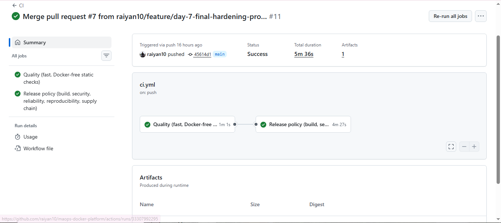 | 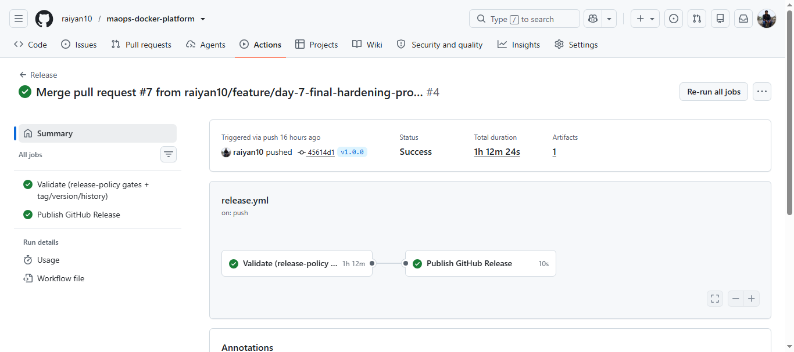 |

| `v1.0.0` GitHub Release | Release assets — SPDX SBOM, `SHA256SUMS`, pinned Trivy scan |
|---|---|
| 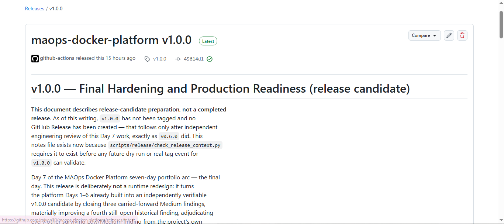 | 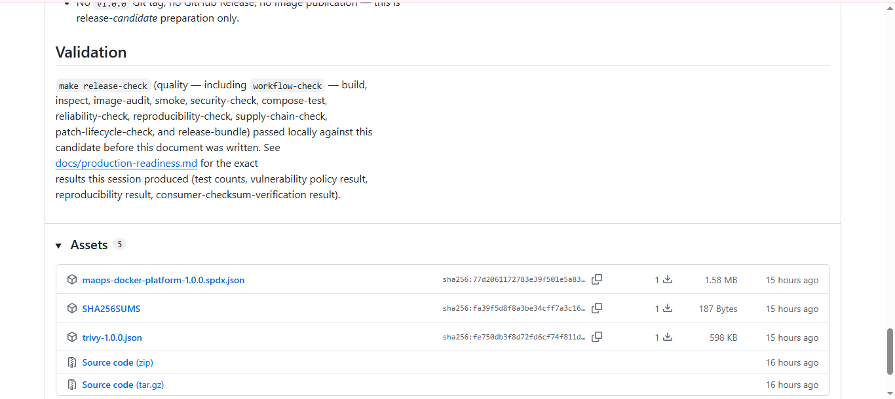 |

| Consumer verification — `sha256sum -c SHA256SUMS` against the downloaded release assets |
|---|
| 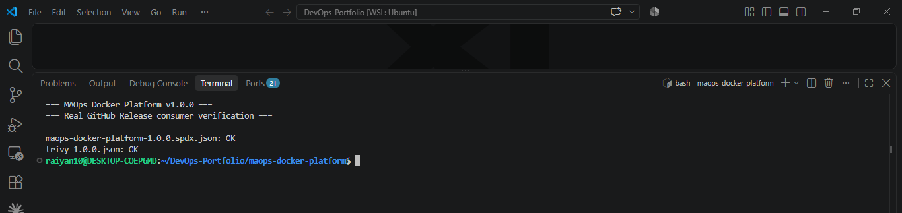 |
